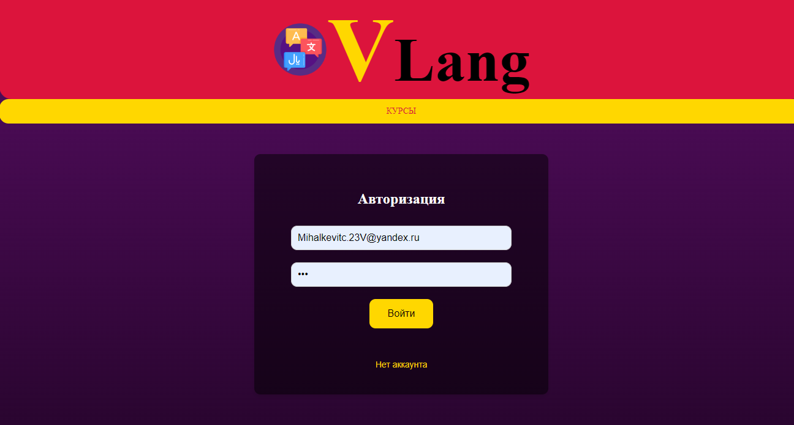
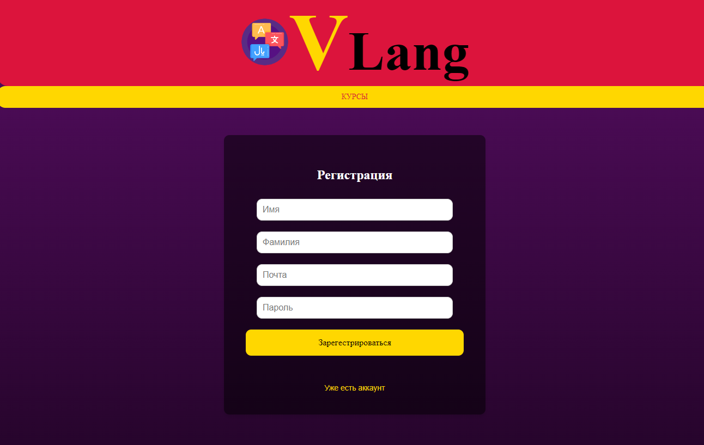
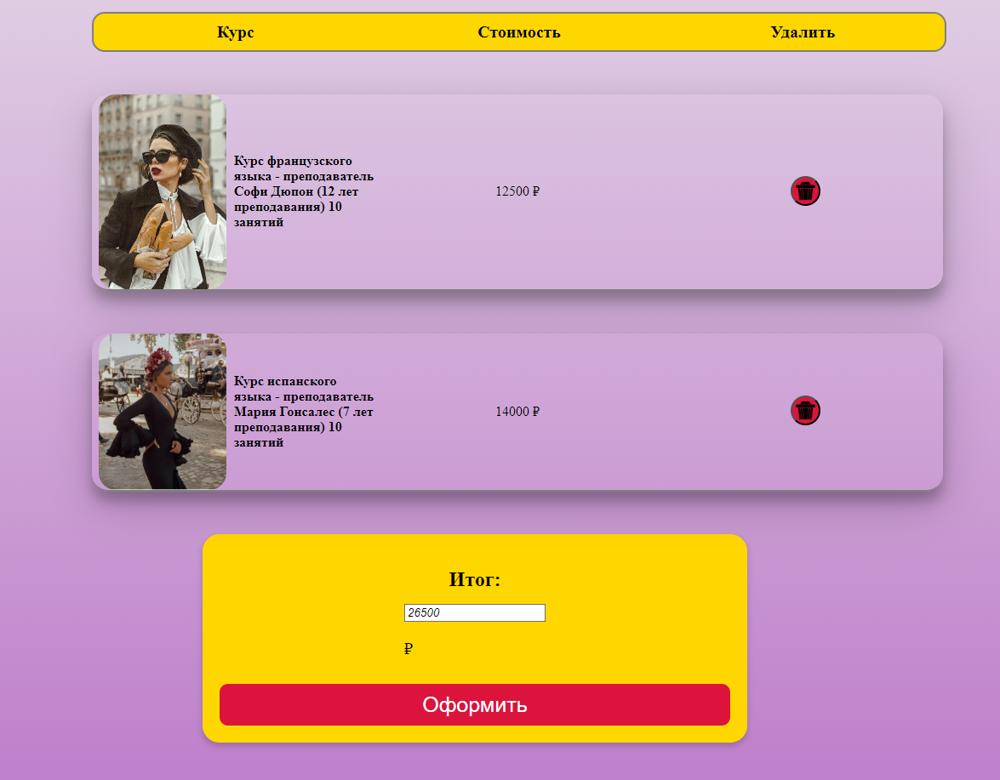
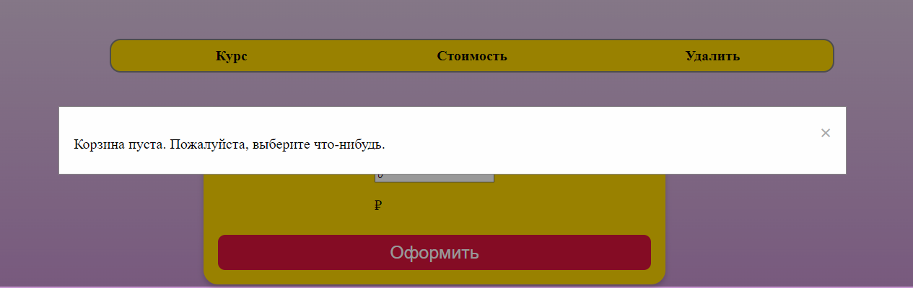
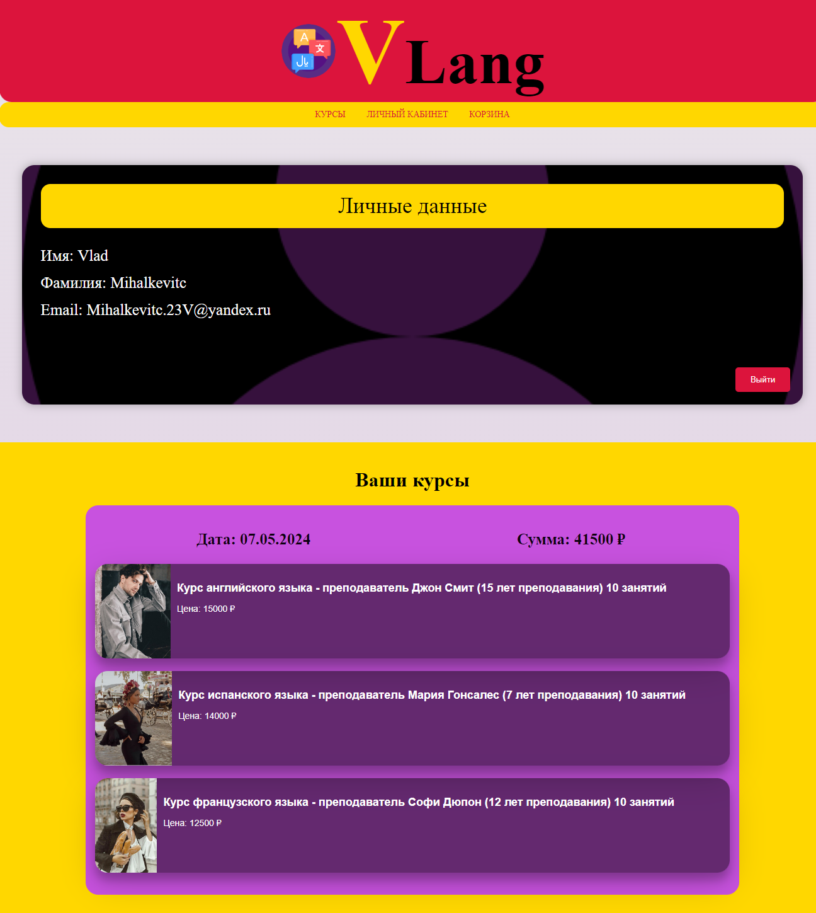

# Веб-приложение «Школа иностранных языков»

Это веб-приложение разработано для онлайн-школы иностранных языков. Оно предоставляет удобный функционал для регистрации пользователей, просмотра курсов, добавления их в корзину и покупки с отправкой почтового уведомления.

## Цель проекта
Разработка веб-приложения с удобным функционалом для онлайн-школы иностранных языков.

## Основные функции
- **Регистрация и авторизация пользователей**.
- **Просмотр доступных курсов**.
- **Добавление курсов в корзину**.
- **Покупка курсов** с отправкой почтового уведомления.

## Стек технологий
- **Backend**: Java, Spring Boot, Spring Data JPA, Spring Security.
- **Frontend**: Thymeleaf, HTML, CSS, JavaScript.
- **База данных**: PostgreSQL.
- **Инструменты**: Gradle (система сборки), Postman (тестирование API).

## Особенности реализации
- **Spring Boot**: Ускоренная разработка и высокая надежность.
- **Spring Security**: Обеспечение безопасности приложения.
- **Thymeleaf**: Создание динамических и интерактивных пользовательских интерфейсов.
- **PostgreSQL**: Надежное хранение и управление данными.
  
## Скриншоты

### ГлСтраница авторизации

### Cтраница регистрации

### Страница каталога курсов

### Cтраница корзины

### Уведомление о пустой корзине

### Личные данные пользователя

### История покупки курсов

